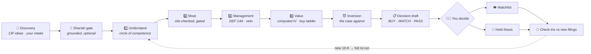

<div align="center">

# 🦉 Owner's Manual

**A local-first investment research workflow with harness-verified grounding,<br/>an append-only audit ledger, and optional Shariah screening.**

[](https://github.com/i314nk/owlfolio/actions/workflows/ci.yml)


[](LICENSE)

[What it is](#what-it-is) ·
[Screenshots](#see-it-in-action) ·
[Install & run](#install--run-the-dashboard) ·
[Architecture](#repository-map) ·
[Portfolio notes](#as-a-portfolio-piece--what-this-demonstrates)

*(Engine namespace: Owlfolio — `OWLFOLIO_*` env vars, `@owlfolio/*` packages, the repo name, and the `owlfolio` CLI alias keep the internal name so existing configs and ledgers keep working.)*

</div>

> ## 🎓 An educational project and portfolio piece
>
> Owner's Manual is a **personal educational project and CV portfolio piece**: it exists to
> learn — and to demonstrate — how to build a local-first product around grounded LLM
> orchestration, event-sourced auditability, and a deterministic finance core. It is an
> **alpha** under active development: features are incomplete, interfaces change without
> notice, and some capabilities are deliberately gated off until they pass verification.
>
> It is **not investment advice** and not a robo-advisor, brokerage integration, tax
> software, or a fatwa engine. Nothing it produces is a recommendation to buy or sell
> anything. Run it locally, read the limitations below, and treat every model output as a
> draft for a human to judge.

---

<div align="center">

| | |
|---:|:---|
| **Stack** | TypeScript · Next.js (app router) · pnpm monorepo · SQLite (`node:sqlite`) |
| **Surface** | Local web app at `127.0.0.1:3000` · read-only CLI · one-tick worker |
| **Ledger** | Append-only events with causation/correlation IDs — every claim auditable |
| **Providers** | OpenRouter (one key, many models) · experimental local Ollama/vLLM |
| **Grounding** | SEC EDGAR only, harness-fetched, SHA-256-verified, fail-closed |
| **Automation** | Notify-only by design — the app alerts, **you** initiate everything |

</div>

---

## See it in action

**Setup** — the guided provider setup (OpenRouter, or a local Ollama/vLLM endpoint; one model
runs the whole analysis) and the live Command Center with its duty nudges:


**An analysis** — a real grounded dossier (Microsoft): the pillar cards with their verdicts
(wide moat · management · the computed IV and buy-below), the cited lane findings, and the
adversarial inversion arguing the case against itself:


**The pages** — the Command Center, Superinvestors 13F discovery, the research library, the
watchlist zone board and held-thesis portfolio (rows expanded into their decision cards with the
load-up → buy → IV price ladder), the pipeline observatory, the decision-trail audit, and Learn:


---

## What it is

Owner's Manual runs a strategy-driven research workflow (default: **Buffett 4-Pillar**) on
your own machine — the four pillars applied in order, every step recorded in an append-only
SQLite event ledger so every number and claim is auditable back to its source:



- **A failed gate ends the run before further spend** — an out-of-circle business, a below-gate
  moat, or a Shariah fail is a recorded early exit, not a silent skip.
- **Pillar 4 is arithmetic**: intrinsic value on free cash flow (the base year anomaly-guarded
  against one-offs), the exit multiple anchored to named comparables, a 30% margin-of-safety buy
  threshold and a 50% load-up threshold.
- **Transitions are yours**: watchlist confirmations, holding opens and closes are explicitly
  user-authored ledger events — machine actors are rejected at the ledger level.

> **Strategy credit** 📖 — the Buffett 4-Pillar method implemented here was shaped by
> [*The New Money Strategy: The Modern Guide to Rational, Long-Term Investing*](https://www.amazon.com/New-Money-Strategy-Long-Term-Investing/dp/1394369840)
> by **Brandon van der Kolk**, creator of the [New Money](https://www.youtube.com/channel/UCvSXMi2LebwJEM1s4bz5IBA)
> YouTube channel — the book that helped me understand and formulate Buffett's approach.
> The implementation, the thresholds, and any errors are my own.

The core design rule is **"code computes, judgment proposes"**:

- Deterministic code computes numbers (free cash flow, intrinsic value and
  the buy thresholds, ratios, the purification rate). Models never set a
  figure anyone acts on.
- Models propose judgments (moat, management, thesis) — but every citable source is
  fetched by the harness itself (SSRF-guarded, SEC-host-allowlisted),
  SHA-256-hashed, and recorded in a source ledger. Citations that don't verify
  are discarded, and judgments built on them fail closed to a visibly flagged
  abstain. A model cannot cite what the harness didn't verify.

### The grounded document set (SEC EDGAR)

- Annual reports — 10-K, 20-F, 40-F — numbers via XBRL company facts, text
  readable by Item through a hash-verified `read_source` tool.
- Interim filings — 8-K (weighted by item code: impairments/restatements/exec
  departures are strong signals, routine earnings announcements are not, and
  the EX-99 press-release exhibits are grounded alongside the cover), 10-Q
  (narrative readable; interim numbers quarantined as context), 6-K for foreign
  filers.
- DEF 14A proxy statements for the management/governance lane.
- Cross-run persistence: source bundles store pointers + hashes (never
  content); EDGAR's immutable archive URLs let any source be re-fetched and
  re-verified on demand, forever.

### Built and working today (local alpha)

| | Area | What works |
|---|---|---|
| 🖥️ | **The surfaces** | Browser onboarding, Command Center, research cockpit, watchlist zone board, held-thesis portfolio, pipeline observatory, decision-trail audit, provider status, and a Learn section documenting the whole harness. |
| 📇 | **Compact boards** | One home per name: a one-line row ("TICKER · buy ≤ / now") expanding into a decision card with the load-up → buy → IV price ladder, always showing the latest non-superseded analysis. Held names live on the portfolio and return to the watchlist when a holding closes. |
| 🕌 | **Optional Shariah screening** | Default ON, grounded, harness-recomputed AAOIFI ratios. OFF is fail-visible: gates record explicit DISABLED decisions (never a fake pass), boards show GATE OFF, Shariah spend stops, and names admitted while OFF stay labeled forever. |
| 🔭 | **Superinvestors (13F)** | Seven owner-curated value investors tracked via quarterly SEC 13F filings — portfolios as manager cards, buys/sells as one action heat-map with your names flagged. Every figure stamped "as of · filed" (~45-day lag); a signal is an idea to research, never a copy trade. |
| 🧠 | **The research swarm** | Multi-agent lanes with a hardened circle-of-competence gate (k-sample unanimous agreement + grounded evidence floors, tunable) — "outside the circle" is a recorded early exit, not a failure. |
| 🔁 | **Thesis re-review** | On demand or per worker tick: new filings since a decision diffed against the recorded thesis and break triggers → INTACT / WEAKENED / BROKEN — or honestly INCONCLUSIVE / UNVERIFIED. A new 10-K raises "full re-analysis recommended" with a confirm-gated superseding re-run. |
| 🔔 | **Duty nudges** | There is no autonomous scheduler *by design* — the Command Center computes from the ledger when a configured rhythm lapsed (13F harvest, thesis check-in, annual re-analysis) and links to where **you** run it. Notify-only, locked by test. |
| 🛡️ | **Pre-spend guards** | Ticker validation against SEC's filer list before any case is minted (`BRK.B` → `BRK-B` auto-normalized); an anomaly-guarded DCF base (a latest year >25% off the 5-year median is replaced by the median, with a loud FACT flag — symmetric for windfalls). |
| 📝 | **Human-authored transitions** | Watchlist removals and holding closes record your reason; machine actors are rejected at the ledger level. The app never trades — a close records the exit you executed at your broker. |
| 🕵️ | **Insider Form 4 signal** | Deterministic parsing (never a model judgment): a computed digest for the management lane, a sell-cluster trigger, and a dossier card. |
| 🔎 | **Decision-trail audit** | The audit page defaults to what matters — user transitions, gates, verdicts, failures — with the full raw event stream one click away and trace links that always resolve. |
| 🌐 | **Translation on demand** | English-only UI; any language via page translation (the shell control drives Chromium’s on-device Translator API; Firefox’s built-in translate is also on-device). Tickers, ids, commands, and env names carry `translate="no"` so no translator corrupts them. |
| ⚙️ | **CLI & worker** | A read-only CLI (`owners-manual start\|status\|doctor`) and a one-tick, dry-run/mock-safe worker recording observations and drafts — it never auto-approves decisions, trades, confirmations, or overrides. |

<details>
<summary><b>Not done yet — deliberately</b> (the honesty list: what this alpha does not do)</summary>


- **No scheduler / unattended automation.** Every worker task is
  scheduler-shaped (one-tick, cadence metadata recorded), but nothing fires
  them automatically yet. That arc is gated on an explicit unattended-spend
  policy.
- **Provider/model choice is the user's responsibility.** Only the
  deterministic mock provider carries a certification report. OpenRouter (the
  default) runs a proven grounded tool loop and is usable with one API key;
  certification is an **optional deeper audit** a user can run per model, and
  support labels stay `experimental` until a target-specific report exists.
- **One model runs the whole analysis.** There is no model tiering: the single
  configured reasoning model runs every stage, so the analysis is only as good
  as the model you choose. Deterministic work (valuation math, ratio checks,
  parsing) is pure code and never uses a model.
- **The local provider (Ollama / vLLM) is UNSTABLE / EXPERIMENTAL / UNTESTED.**
  It is an OpenAI-compatible endpoint you run yourself; it has not been
  exercised end-to-end — expect failures. Runs fail closed and are never
  silently trusted.
- **Grounding quality depends on the routed model's tool support.** When a
  routed model does not support the multi-step tool loop, the grounded agent
  degrades to a no-tools path: the harness pre-verifies and injects the filing
  text instead of the model reading it mid-run via `read_source`. Judgments
  stay grounded and cite-checked either way, but interactive reads need a
  tool-loop-capable model.
- No broker sync, live trading, automatic portfolio actions, market-data
  ingestion hardening, tax-grade accounting, or formal Shariah scholar review.
- A historical (as-of-date) backtester is deferred pending point-in-time data
  quality.
- Known issue: the Next/Turbopack NFT import-trace warning noted below.

Gaps are tracked in `docs/ALPHA_READINESS.md`.

</details>

---

## Where this is headed

The intent is a **personal fiduciary analyst that runs on your machine** — an
always-on research department for one investor, with the judgment loop of a
disciplined value shop and a complete audit trail:

- **From human-fired to scheduled.** Every capability is already a one-tick,
  cadence-tagged unit. The next structural arc is the scheduler that fires
  them unattended — quarterly re-review sweeps when new filings land, daily
  price checks against frozen buy-belows, discovery sweeps feeding the
  candidate pipeline — governed by an explicit unattended-spend policy so an
  idle machine can never silently burn provider budget.
- **The agent watches; you decide — permanently.** "Human-authored
  irreversible transitions" is a design commitment, not an alpha limitation.
  The end state is not an auto-trader: it is a system that reads every filing
  the day it lands, keeps every thesis honestly marked (intact / weakened /
  broken), and interrupts you only when something crosses a line you defined.
- **Trust through evidence, not claims.** Per-model certification runs you can
  execute yourself, the golden-set qualification gate, and eventually a
  point-in-time backtester — so the system's track record is a recorded
  artifact, not marketing.
- **Grounded Shariah screening.** The front gate, harness-recomputed AAOIFI
  ratios, and the purification rate as dossier guidance — aiming for
  scholar-reviewable methodology, while staying honest that software is not a
  fatwa. (The obligation/payment bookkeeping was deliberately removed: its
  inputs are unverifiable by design, and confidently wrong purification
  amounts are worse than none.)
- **Local forever.** Your research, ledger, and keys stay on your machine. The
  only thing that leaves is a grounded, SSRF-guarded fetch to a public filing
  archive or the model provider you chose.

---

## Install & run the dashboard

Prerequisites: **Node.js 22+** (the ledger uses the built-in `node:sqlite`; Corepack ships with Node) and **git**. No
database to install — the ledger is a local SQLite file the app creates for
you.

**1. Clone and install**

```bash
git clone https://github.com/i314nk/owlfolio.git
cd owlfolio
corepack enable
corepack pnpm install
```

**2. Start the app**

```bash
corepack pnpm dev
```

…or use the zero-setup launcher, which starts the app *and* opens your
browser:

```bash
./owners-manual start
```

**3. Open the dashboard**

Go to `http://127.0.0.1:3000`. First launch walks you through onboarding in
the browser — pick personal-local mode, choose a provider (OpenRouter is the
default: create a key at openrouter.ai, paste it in) and pick a model. That's
it: the Command Center is your dashboard, and you can start your first
research run from there.

Everything is local: runtime state lives under `data/` (git-ignored), and API
keys live in a local env file (`OWLFOLIO_ENV_FILE`, default `~/.owlfolio/.env`)
— never in the ledger, logs, or git.

To check the install or diagnose problems:

```bash
./owners-manual status   # mode, provider/model, readiness, onboarding gate
./owners-manual doctor   # config, credential file permissions, ledger, certifications
```

Optional — run with explicit isolated paths:

```bash
OWLFOLIO_PROJECT_DIR=$PWD \
OWLFOLIO_APP_CONFIG_PATH=$PWD/data/app-config.json \
OWLFOLIO_PERSONAL_LEDGER_PATH=$PWD/data/personal-ledger.sqlite \
OWLFOLIO_SOURCE_LEDGER_PATH=$PWD/data/source-ledger \
corepack pnpm dev
```

---

## Repository map

```text
apps/
  web/       Next.js web app and API routes (the primary surface)
  worker/    local one-tick scheduled-task worker (dry-run/mock-safe)
  cli/       read-only launch/inspect/diagnose CLI (owners-manual start|status|doctor)
packages/
  ledger/    append-only SQLite event store, event contracts, projections
  workflow/  research swarm, grounding, EDGAR adapters, re-review, reviews
  providers/ provider catalog, adapters, certification runner
  strategies/ Buffett 4-Pillar strategy policy: source policy, valuation, checklist
  shared/    app config and shared domain/provider types
  shariah/   Shariah policy helpers
```

Important docs:

- `CLAUDE.md` — current development instructions for this TypeScript branch.
- `docs/ALPHA_READINESS.md` — release gate, verification status, remaining gaps.
- `docs/WORKER.md` — worker safety model and commands.
- `docs/architecture/owlfolio-v2-domain-boundaries.md` — event families and route ownership.
- `docs/architecture/owlfolio-v2-provider-model-support.md` — provider support matrix (the bounding document for all support claims).

---

## Provider support

Owner's Manual distinguishes **readiness** (a key is configured) from
**certification** (a recorded report proving the grounded research contract).
The retired CLI/OAuth lanes (Codex CLI, Claude CLI, Gemini CLI) were removed on
2026-06-29; the surviving providers all share one function-calling grounded
tool loop.

| Provider id | Role | Support |
| --- | --- | --- |
| `mock-provider` | Deterministic test provider (tests/e2e only — demo mode was removed; the app is unconfigured → personal-local) | **Certified** for the audited test slice. |
| `openrouter` | Default personal-local provider — one `OPENROUTER_API_KEY` routes to many models | Experimental. Proven grounded tool loop; **this is where nearly all live testing has happened**. Model choice is yours. |
| `local` | Local OpenAI-compatible endpoint you run yourself (Ollama / vLLM; `OWLFOLIO_LOCAL_API_BASE_URL`, key optional) | **UNSTABLE / EXPERIMENTAL / UNTESTED** — not exercised end-to-end; expect failures; fail-closed. Data stays on your machine; quality tracks the local model you serve. |

**Certification is the user's responsibility and optional**: pick a capable
reasoning model (reasoning + tool calling + structured output — the model
picker's floor) and you can run research immediately; the certification runner
(`pnpm certify:providers`) is a deeper per-model audit you may run when you
want recorded evidence, and support labels stay `experimental` until such a
report exists. Either way the grounding harness is what protects you: docs/UI
never claim more than the latest report proves, and native/provider-side web
search is disabled by construction — the harness executor is the only egress.

---

## Worker

Run one dry-run tick from the repo root:

```bash
corepack pnpm worker -- --once --dry-run --define-defaults
```

Limit a tick to one task kind:

```bash
corepack pnpm --filter @owlfolio/worker dev -- --task-kind re_review_check
corepack pnpm --filter @owlfolio/worker dev -- --task-kind watchlist_monitor
```

Nine task kinds exist (the quarterly re-review check, the watchlist/holdings
monitors, the Shariah re-screen, the held+watched price poll, forecast
resolution, 13F discovery, and the cadence-engine passes). All are one-tick
and human-gated:
the worker records observations and drafts, and provider spend is bounded
(e.g. the re-review sweep only spends on strong triggers, capped per tick).

---

## Verification

Gates on the final tree:

```bash
git diff --check
corepack pnpm typecheck
corepack pnpm test
corepack pnpm lint
corepack pnpm audit --filter @owlfolio/web --prod --audit-level moderate
NODE_OPTIONS=--disable-warning=ExperimentalWarning corepack pnpm --filter @owlfolio/web exec next build
corepack pnpm e2e
```

Provider certification:

```bash
corepack pnpm certify:providers
```

Known warning: Next/Turbopack can emit an NFT/import-trace warning involving
local filesystem helpers (`next.config.mjs` / `appConfigStore` / `onboarding`).
The Playwright e2e suite (9 specs) is green as of this branch.

---

## As a portfolio piece — what this demonstrates

Beyond the product itself, this repo is a worked example of a set of engineering
disciplines applied end-to-end:

- **Event sourcing as the source of truth** — an append-only SQLite ledger with
  stable event ids and causation/correlation chains; every screen is a
  projection, and curated views never rewrite the record.
- **Grounded LLM orchestration** — a multi-agent research swarm where models
  propose and the harness verifies: SSRF-guarded fetching, SHA-256'd sources,
  cite-checking against a hash-verified corpus, and fail-closed abstains when
  evidence doesn't hold.
- **A deterministic finance core** — valuation, thresholds, ratios, and the
  purification rate are pure code with recorded provenance; models never set a
  number anyone acts on.
- **Fail-closed, fail-visible design** — degraded states are named on the
  surface that shows them (gate-off chips, anomaly flags, unpriced dossiers)
  rather than silently papered over.
- **Test discipline** — TDD for behavior changes; ~2,400 unit/integration
  tests plus a Playwright e2e suite and a provider certification harness, all
  run as release gates.
- **Honest product copy as a testable invariant** — vocabulary rules (no
  roadmap promises, no overclaimed support levels) are locked by tests, not
  style guides.

---

## Shariah screening limitations

Shariah screening is a first-class, fully-grounded, **optional** feature (Settings,
default ON) — but this is an educational project, and its output is never a fatwa:

- The screens are local policy/audit aids. Before acting on any Shariah
  conclusion, obtain a ruling from certified Islamic scholars.
- The dossier states the purification RATE as guidance ("CONDITIONAL — purify
  ~X% of dividends"); tracking and paying it is yours. Owner's Manual deliberately
  keeps no books: bookkeeping built on unverifiable manual inputs was removed
  in the 2026-07 scale-down.
- Provider outputs are drafts/observations. User-authored transitions are
  required for watchlist confirmations, holding opens and closes, watchlist
  removals, and any portfolio action.

---

## Development rules

- TypeScript/pnpm only; the old Python `owlfolio` CLI instructions are retired.
- TDD for behavior changes: failing test first, confirm RED, then implement.
- Keep runtime/generated artifacts out of commits: `data/`, `.next/`, `test-results/`, `playwright-report/`, `*.tsbuildinfo`, `.playwright-runtime/`, `.worktrees/`.
- Never raise provider support claims above the latest certification report.
- Keep provider/worker-authored drafts separate from explicit user-authored ledger transitions.
- No secrets in git, logs, or provider reports.

MIT — see `LICENSE`.
