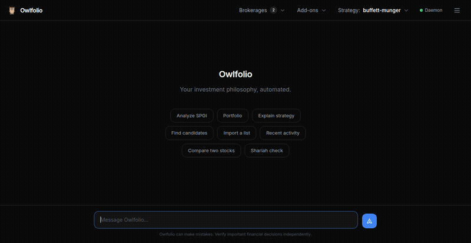

<div align="center">

# Owlfolio

**Your investment philosophy, automated.**

An open-source, methodology-driven investment research agent that runs the full lifecycle:
source candidates, research, value, size, decide, audit.

Your investing philosophy is defined as configuration, not code.

[](https://github.com/i314nk/owlfolio/actions/workflows/ci.yml)
[](https://www.python.org/downloads/)
[](LICENSE)
[](https://docs.anthropic.com/en/docs/agents-and-tools/claude-agent-sdk)

</div>

---

Ships with 7 preset strategies (Buffett, Graham, Lynch, Terry Smith, and more). Bring your own methodology.

<div align="center">

<br><em>Web UI — chat with your AI analyst, track portfolio, manage watchlists, schedule automated tasks</em>
</div>

```bash
owlfolio serve                      # launch the web dashboard
```

The Web UI is the primary interface — chat with your portfolio manager, run analyses, manage scheduled tasks, and browse your audit trail, all from the browser. A full CLI is also available for power users who prefer the terminal.

<details>
<summary><b>Architecture at a glance</b></summary>

```
                    ┌──────────────────────────────┐
                    │        Strategy YAML          │
                    │   (your philosophy as config) │
                    └──────────┬───────────────────┘
                               │
              ┌────────────────┼────────────────┐
              ▼                ▼                ▼
     ┌──────────────┐ ┌──────────────┐ ┌──────────────┐
     │  Financial    │ │  Moat        │ │  Risk        │  ← 3-5 specialist
     │  Analyst      │ │  Analyst     │ │  Analyst     │    subagents per
     │  (Claude)     │ │  (Claude)    │ │  (Claude)    │    strategy
     └──────┬───────┘ └──────┬───────┘ └──────┬───────┘
            │                │                │
            └────────────────┼────────────────┘
                             ▼
                    ┌──────────────────┐
                    │  Synthesis Agent │  ← reconciles findings
                    │  BUY / WATCH /   │    against your strategy
                    │  PASS            │
                    └────────┬─────────┘
                             │
                    ┌────────▼─────────┐
                    │   SQLite (local)  │  ← analyses, portfolio,
                    │   portfolio.db    │    decisions, audit trail
                    └──────────────────┘
```

</details>

---

## Vision

Investing well is not a tooling problem. The hard part is having a coherent
philosophy and applying it consistently — through your own biases, through
noisy headlines, through years of compounding decisions. Most investors who
underperform aren't lacking data; they're lacking a written, repeatable
process.

**Owlfolio is an attempt to give every investor a senior analyst on staff
who follows their methodology, not a generic LLM's intuition.**

The principles that fall out of that goal:

- **Strategy is configuration, not code.** Your philosophy lives in a YAML
  file you can read, edit, fork, and version-control. The runtime adapts.
  Switching from Buffett to GARP is one command, not a fork.
- **Specialists, not a single LLM.** A real analyst team has roles: someone
  who reads the financials, someone who scores the moat, someone who hunts
  for risks. Owlfolio spawns those roles in parallel, each with its own
  brief, then a synthesis agent reconciles them into a single decision.
  Same shape as a real research team, same separation of concerns.
- **Synthesis owns the decision.** No mechanical formulas pick BUY/WATCH/PASS.
  The synthesis agent reads the strategy's plain-English methodology and
  every specialist's findings, then judges. Strategy YAMLs change behavior
  without changing code; mistakes are visible because the reasoning is
  written down.
- **Personal, local, and yours.** Owlfolio runs on your laptop. Your
  portfolio, your memory, your decision journal — all in a SQLite file you
  own. No SaaS dashboard, no telemetry, no portfolio data leaving the box
  unless you mount it on the public internet on purpose.
- **Claude-only, by design.** Owlfolio is not a multi-LLM abstraction layer.
  It is a Claude Agent SDK portfolio-research system: specialist subagents,
  tool-bounded web research, adaptive extended thinking, and synthesis are
  tuned as one coherent agentic workflow. Avoiding provider abstraction is
  intentional; it keeps the codebase focused and the prompt engineering
  consistent.
- **Honest about what it isn't.** Not a robo-advisor. Not a backtesting
  suite (yet). Not a substitute for thinking. Not a deterministic
  numeric screener. It's a disciplined *agentic* research pipeline
  that follows the rules you wrote down and tells you what those rules
  say about a stock. The decisions are still yours.

> **Non-determinism is by design.** Owlfolio's analyses are produced by
> Claude Agent SDK subagents reasoning in natural language — not by
> formula evaluation. The same ticker analyzed twice under the same
> strategy will give two slightly different syntheses (different
> specialist findings, different score nudges, different prose). The
> *decision logic* is consistent because it lives in your strategy
> YAML; the *judgment* fluctuates because that's what an analyst team
> looks like. If you want deterministic screens, use Finviz. If you
> want a written-down philosophy applied with judgment and an audit
> trail, that's the design.

The long arc: a tool you can hand to a thoughtful first-time investor, who
can pick a preset strategy, run their first analysis, and learn what
disciplined value investing actually looks like in practice — and a tool
that scales up to a serious investor running their own custom methodology
across hundreds of analyses, with the audit trail and consistency that
implies.

---

## Quick Start

### Option A: Claude Code (recommended)

If you have [Claude Code](https://docs.anthropic.com/en/docs/claude-code) installed, it can set up everything for you:

```bash
git clone https://github.com/i314nk/owlfolio && cd owlfolio
claude
# Then say: "set up owlfolio"
```

Claude Code reads the project's `CLAUDE.md` and handles the full setup — Python venv, dependencies, credentials, strategy selection, and verification. No manual steps.

### Option B: Install script

```bash
git clone https://github.com/i314nk/owlfolio && cd owlfolio
./install.sh                 # sets up Python venv and installs deps
```

### Then use it

```bash
owlfolio doctor                      # confirm credentials, strategy, DB, daemon
owlfolio serve                       # launch the web dashboard (primary interface)
```

Open `http://localhost:8000` and you're in — chat with your AI analyst, run analyses, manage your portfolio, and configure scheduled tasks, all from the browser. First-run setup creates only safe price/P&L checks; slow Claude research jobs are opt-in so onboarding stays predictable.

**Prefer the CLI?** Everything in the Web UI is also available from the terminal:

```bash
owlfolio analyze AAPL                # full specialist analysis
owlfolio analyze AAPL --shariah      # add Shariah compliance specialist
owlfolio find --count 15             # agentic discovery for the active strategy
owlfolio import tickers.csv --name watch-q2     # import your own ticker list
owlfolio analyze-list watch-q2       # batch analyze a saved list (concurrency-capped)
owlfolio portfolio                   # holdings + live P&L
owlfolio chat                        # CLI chat with your portfolio manager
owlfolio strategy --use buffett-munger   # switch active strategy
owlfolio doctor                      # one-stop health report when something's off
```

---

## How It Works

Your investment methodology lives in a YAML strategy file. Three ways to configure:

1. **Conversational** (recommended) -- `owlfolio setup` walks you through it
2. **Manual** -- edit `methodology.yaml` directly
3. **Presets** -- `owlfolio strategy --use buffett-munger`

When you run `owlfolio analyze TICKER`, the system spawns specialist subagents in parallel (3-5 per strategy), each independently researching the company from a different angle. A synthesis agent combines their findings into a final decision (BUY / WATCH / PASS). Every analysis — including the per-specialist findings — is persisted with an integer id you can quote later as `#42`.

Each strategy defines its own specialist roster. A Buffett strategy spawns financial, moat, and risk analysts. A growth strategy spawns TAM, unit economics, and competitive dynamics analysts. The specialists adapt to the philosophy.

### Sourcing candidates

Two complementary paths for getting tickers into the analysis pipeline — Owlfolio doesn't ship a Finviz-style numeric screener (deliberately):

- **Agentic discovery** (`owlfolio find`) reads the strategy's natural-language discovery brief (Russell 3000, Dividend Aristocrats, etc.) and uses WebSearch to compile a ranked candidate list. Slow (3-10 min), costs API credits, on-vision for the "AI analyst on staff" goal. Each ticker is yfinance-validated to drop hallucinations.
- **External import** (`owlfolio import`) takes whatever ticker list you have — pasted CSV, a file path, comma-separated string — from any external screener, paid subscription, or hand-curated list. Same yfinance-validation against typos.

Both paths persist as named candidate lists. Run `owlfolio analyze-list NAME` to deep-analyze every ticker in the list (concurrency-capped at 2 to avoid rate-limit / billing surprises).

### Scheduled Tasks — Automation That Runs While You Sleep

Owlfolio's background daemon runs scheduled tasks on cron schedules, so your investment process keeps working when you're not at the keyboard. First-run setup intentionally creates only safe, non-LLM monitoring tasks (`watchlist-check` and `portfolio`). Credit-burning Claude research jobs like discovery, holding reviews, and list analysis are opt-in from the Web UI's Schedule tab or via CLI. See [`docs/AUTONOMOUS_SCHEDULE_POLICY.md`](docs/AUTONOMOUS_SCHEDULE_POLICY.md) for the safe-vs-research cadence policy.

**Built-in examples:**

| Task | What it does | Typical schedule |
|------|-------------|-----------------|
| Price alerts | Scans watchlist for tickers entering buy zones | Safe default: weekdays |
| Portfolio check | Refreshes holdings / P&L view | Safe default: weekdays |
| Holdings review | Re-runs analysis on current holdings to catch thesis drift | Opt-in |
| Candidate screening | Batch-analyzes a saved ticker list overnight | Opt-in |
| Agentic discovery | Finds new strategy-fit candidates with Claude WebSearch | Opt-in |

**Custom tasks:** Schedule any Owlfolio command to run on a cron cadence:

```bash
owlfolio schedule "earnings-check" "owlfolio watchlist-check" "0 7 * * 1-5"   # weekday mornings
owlfolio schedule "quarterly-review" "owlfolio review-holdings" "0 9 1 */3 *" # first of each quarter
owlfolio tasks                                                                 # view all scheduled tasks
```

Every task run is logged with start time, exit code, and output excerpts — visible in the Web UI's Activity tab and Alerts tab. Silent failures become visible failures.

### Audit trail

Every meaningful action — analyses, candidate lists, recorded buy/sell decisions, daemon-fired scheduled task runs — lands in a unified Activity feed. The Web UI's Activity tab shows the chronological view; the chat agent reads the same feed via the `get_activity` MCP tool. Each row carries a reference (`#42` for analyses, `d#7` for decisions, `r#12` for task runs, the list name for candidate lists) you can quote in chat to drill into details.

---

## Commands

| Command | Description |
|---------|-------------|
| `owlfolio setup` | First-time setup (auth, strategy, test) — usually invoked by `install.sh` |
| `owlfolio doctor` | Single colored health report (credentials, strategy, DB, port, daemon, runtime) |
| `owlfolio analyze TICKER` | Full specialist-driven analysis |
| `owlfolio analyze TICKER --shariah` | Analysis with Shariah compliance specialist |
| `owlfolio analyze TICKER --skip-llm` | Show last saved analysis (no new run) |
| `owlfolio find` | Agentic discovery for the active strategy (slow, on-vision) |
| `owlfolio import SOURCE --name LIST` | Import a CSV / inline ticker string into a named list |
| `owlfolio lists` | Show every saved candidate list with progress |
| `owlfolio list-show NAME` | Show all candidates in a named list |
| `owlfolio list-delete NAME` | Delete a candidate list (cascade) |
| `owlfolio analyze-list NAME` | Batch-analyze every ticker in a list (concurrency-capped) |
| `owlfolio compare TICKER1 TICKER2` | Side-by-side comparison from saved analyses |
| `owlfolio portfolio` | View holdings with live P&L |
| `owlfolio add TICKER SHARES PRICE` | Record a purchase |
| `owlfolio sell TICKER SHARES PRICE` | Record a sale |
| `owlfolio watch TICKER` | Add to watchlist |
| `owlfolio snapshot` | Take a portfolio snapshot |
| `owlfolio performance` | Portfolio performance over time |
| `owlfolio strategy --list` | List all 7 preset strategies |
| `owlfolio strategy --use NAME` | Switch active strategy |
| `owlfolio strategy --info NAME` | Detailed strategy summary |
| `owlfolio specialists` | Show the specialist roster for the active strategy |
| `owlfolio config show` | View active strategy config |
| `owlfolio config validate` | Validate strategy file |
| `owlfolio analyses` | View saved analysis history |
| `owlfolio history` | Decision journal |
| `owlfolio alerts` | Recent alerts and task results |
| `owlfolio tasks` | View scheduled tasks |
| `owlfolio schedule NAME CMD CRON` | Create a scheduled task |
| `owlfolio daemon` | Run background daemon for scheduled tasks |
| `owlfolio chat` | Chat with your AI portfolio manager (CLI) |
| `owlfolio shariah TICKER` | Standalone Shariah compliance check (persists as a `#NN` audit row) |
| `owlfolio serve` | Start web UI (native mode) |
| `owlfolio serve --restart` / `--stop` | Refresh or stop the running web UI |
| `owlfolio status` | System status (auth, strategy, version) |

---

## Preset Strategies (7 built-in)

Each preset names its tiers after what it actually scores — so the synthesis
prompt and CLI output read naturally in the strategy's own vocabulary. See
`docs/STRATEGY_GUIDE.md` for the full convention.

- `buffett-munger` -- Buffett/Munger, wonderful businesses at fair prices (moat tiers: inevitable / monopoly / wide / narrow)
- `quality-compounder` -- Terry Smith, highest-quality companies at fair prices (quality tiers: generational / exceptional / high / inconsistent)
- `100-bagger` -- Chris Mayer, small compounders held for decades (compounder tiers: generational / exceptional / proven / unproven)
- `garp` -- Peter Lynch, growth at a reasonable price (growth-quality tiers: exceptional / high-quality / steady / fragile grower)
- `growth` -- Lynch/Fisher, fast growers (growth tiers: hypergrower / leader / contender / fading)
- `dividend-income` -- Aristocrat investing, reliable growing dividends (dividend tiers: aristocrat / achiever / contender)
- `deep-value` -- Graham/Schloss, statistical bargains below tangible book value (safety tiers: fortress / safe / risky / dangerous)
- Custom -- define your own via `owlfolio setup --create`

---

## Features

- **Web UI (primary interface)** -- browser-based dashboard with live token streaming, specialist progress cards, and sidebar tabs for Portfolio / Watchlist / Lists / Activity / Alerts / Schedule (`owlfolio serve`). Chat with your AI analyst, run analyses, and manage everything from the browser.
- **Scheduled tasks** -- cron-based background automation for earnings checks, price alerts, holdings reviews, and batch screening. Every run is logged with exit codes and output excerpts. Configure from the Web UI's Schedule tab or CLI.
- **Specialist subagents** -- 3-5 AI analysts per strategy, running in parallel, each fetching its own data
- **Saved specialist findings** -- every analysis persists the per-specialist output (not just the synthesis result), so the audit trail can answer "why BUY?" with the underlying evidence — and a future synthesis-prompt change can re-synthesize against saved findings without re-paying for the research phase
- **Configurable methodology** -- your philosophy, your rules, defined in YAML (two-zone shape: structured contract + prompt corpus)
- **Activity feed** -- unified chronological audit across analyses, candidate lists, recorded decisions, and daemon-fired task runs. Each row carries a `#NN` reference you can quote in chat to drill into details.
- **Adaptive extended thinking** -- every specialist, the synthesis agent, and both chat surfaces use Claude's adaptive thinking budget
- **Portfolio tracking** -- holdings, cost basis, performance snapshots, alpha vs SPY
- **Candidate sourcing** -- agentic discovery (`find`) for the natural-language path; CSV / inline import (`import`) for whatever external screener you already use
- **Alert system** -- price alerts, task results, watchlist notifications
- **Decision journal** -- every decision logged with reasoning
- **Memory system** -- persistent context across chat sessions
- **Shariah screening** -- optional Islamic finance compliance with any strategy (also persists as a `#NN` audit row)
- **Add-on pattern** -- Shariah works with any strategy via `--shariah` flag (ESG / Insider trading planned)
- **Full CLI** -- every Web UI action has a CLI equivalent for power users and scripting
- **Free data** -- yfinance + LLM web-search fallback (see [`docs/ARCHITECTURE.md` → Market Data](docs/ARCHITECTURE.md) for reliability tradeoffs and hardening options). No paid market-data API required.

---

## Requirements

- Python 3.12+
- **Claude access** — Owlfolio is built exclusively on the [Claude Agent SDK](https://docs.anthropic.com/en/docs/agents-and-tools/claude-agent-sdk). It is Claude-only by design. There is no multi-LLM support and none is planned.

**Authentication (pick one):**

| Method | Best for | How |
|--------|----------|-----|
| **Claude Pro / Max subscription** (recommended) | Individual investors | Install [Claude Code](https://docs.anthropic.com/en/docs/claude-code), run `claude` once to log in. Credentials are stored at `~/.claude/.credentials.json`. Claude Agent SDK usage is covered by Anthropic's subscription Agent SDK credit model, with usage credits/API billing required after the monthly credit is exhausted. |
| **API key** | Developers, teams, CI/CD | Set `export ANTHROPIC_API_KEY=sk-ant-...` in your shell profile. Standard API billing per token. |

> **Cost note:** Owlfolio is token-heavy. A single analysis spawns 3-5 specialist subagents in parallel, each running web research with adaptive extended thinking. A full analysis can consume significant tokens. Subscription auth is convenient for personal use, but Agent SDK usage has its own monthly credit budget; heavy usage may require usage credits or API-key billing.

---

## Why Python

Honest answer: **for the current product, the Python advantage is
weak.** Today's stack — Agent SDK orchestration, FastAPI + htmx +
Alpine Web UI, SQLite for state — is essentially language-agnostic,
and every dependency we actually use has a direct TypeScript
equivalent. We chose Python because the project started in Python; we
*stay* on Python because of one specific bet on the future.

> **The research pipeline is agentic by design.** Analyses are
> produced by Claude Agent SDK subagents reasoning in natural
> language. They are **non-deterministic** — the same ticker analyzed
> twice under the same strategy will give two slightly different
> syntheses. That's not a bug to engineer away; it IS the
> architecture. If you want deterministic numeric screens, use Finviz.
> Owlfolio is "an LLM analyst team applies your written-down
> philosophy."

The Python bet rests entirely on the `docs/FUTURE_PLAN.md`
*measurement* layer: backtesting (`pandas` + `quantstats`), portfolio
analytics, correlation/exposure math. These sit **above** the agentic
pipeline (measuring what it produced), not inside it (the LLM keeps
doing the research). The Python financial-library ecosystem is
genuinely deeper than any TS alternative — `pandas`, `quantstats`,
`vectorbt`, `statsmodels` have no real TS equivalents, and the broker
SDKs / paper implementations / EDGAR helpers are Python-first.

**If that measurement layer ships, Python pays for itself.** If it
doesn't, the Python case becomes hollow retroactively, and a rewrite
to TS would be defensible (better typing, faster startup, cleaner Web
UI, single-source types between server and browser).

For the full analysis — including the dependency-by-dependency
TS-equivalent map, what TS would buy us, what staying on Python costs,
and the explicit tripwires for reconsidering — see
[`docs/ARCHITECTURE.md` → Language Choice](docs/ARCHITECTURE.md).

---

## Project Status

Owlfolio is in active development and ready for daily personal use. The core pipeline (discovery → specialist analysis → synthesis → portfolio tracking → scheduled automation) is complete and running in production.

*What's built:*

- **Strategy-driven pipeline** — 7 preset strategies, two-zone YAML schema (structured contract + prompt corpus), custom strategy creation
- **Specialist subagent architecture** — 3-5 Claude subagents per analysis, running in parallel with independent web research, reconciled by a synthesis agent
- **Agentic discovery** — strategy-aware candidate sourcing with hard gates per strategy, yfinance validation, Shariah-aware filtering
- **Web dashboard** — FastAPI + htmx with live token streaming, specialist progress cards, sidebar tabs (Portfolio / Watchlist / Lists / Activity / Alerts / Schedule)
- **Background automation** — daemon with cron scheduling, full execution history (exit codes, stdout/stderr), resumable batch analysis
- **Audit trail** — every analysis, decision, candidate list, and task run persisted with `#NN` references you can quote in chat
- **Add-on pattern** — Shariah compliance works with any strategy via `--shariah` (discovery + analysis); ESG/Insider planned
- **298 tests** across 14 test files, CI via GitHub Actions

*What's next:* interactive Plotly charts, portfolio analytics dashboard (quantstats + agent narrative), quarterly report generator. See [`docs/FUTURE_PLAN.md`](docs/FUTURE_PLAN.md) for the roadmap.

---

## Documentation

**Active:**

- [Architecture](docs/ARCHITECTURE.md) — pipeline, security model, market data, key design decisions
- [Strategy Guide](docs/STRATEGY_GUIDE.md) — two-zone YAML schema reference + tier-naming convention
- [Future Plan](docs/FUTURE_PLAN.md) — what's been built (Phase 3a-3d) and what's potentially next (backtesting, ESG add-on, form-based strategy editor, etc.)

**Historical (`docs/archive/`):** earlier phase logs are kept for context but
describe architecture that has been replaced. See [`docs/archive/README.md`](docs/archive/README.md) for the index.

---

## Contributing

See [CONTRIBUTING.md](CONTRIBUTING.md) for development setup, PR guidelines, and how to add strategies or specialists.

## Credits

Owlfolio's specialist subagent pipeline, the strategy library, the portfolio model, and the CLI/web UI are original to Owlfolio. Full attribution: [`CREDITS.md`](CREDITS.md).

## License

MIT — see [LICENSE](LICENSE).

---

<div align="center">

Built by [Sultan Al Aryani](https://github.com/i314nk)

</div>
